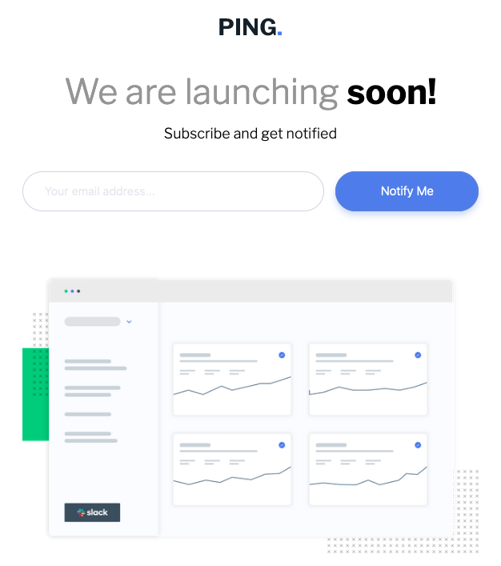

# Frontend Mentor - Ping coming soon page solution

This is a solution to the [Ping coming soon page challenge on Frontend Mentor](https://www.frontendmentor.io/challenges/ping-single-column-coming-soon-page-5cadd051fec04111f7b848da). Frontend Mentor challenges help you improve your coding skills by building realistic projects.

## Table of contents

- [Frontend Mentor - Ping coming soon page solution](#frontend-mentor---ping-coming-soon-page-solution)
  - [Table of contents](#table-of-contents)
  - [Overview](#overview)
    - [The challenge](#the-challenge)
    - [Screenshot](#screenshot)
    - [Links](#links)
  - [My process](#my-process)
    - [Built with](#built-with)
    - [What I learned](#what-i-learned)
    - [Continued development](#continued-development)
    - [Useful resources](#useful-resources)
  - [Author](#author)

## Overview

### The challenge

Users should be able to:

- View the optimal layout for the site depending on their device's screen size
- See hover states for all interactive elements on the page
- Submit their email address using an `input` field
- Receive an error message when the `form` is submitted if:
  - The `input` field is empty. The message for this error should say _"Whoops! It looks like you forgot to add your email"_
  - The email address is not formatted correctly (i.e. a correct email address should have this structure: `name@host.tld`). The message for this error should say _"Please provide a valid email address"_

### Screenshot

### Links

- Solution URL: [Add solution URL here](https://your-solution-url.com)
- Live Site URL: [ping-coming-soon-page-rust-psi.vercel.app](https://ping-coming-soon-page-rust-psi.vercel.app/)

## My process

### Built with

- Semantic HTML5 markup
- CSS custom properties
- Flexbox
- Desktop-first workflow
- [React](https://reactjs.org/) - JS library
- SASS/SCSS - For styles

### What I learned

For this project I reused the `email validation`logic built in another project ([github.com/melwynt/intro-component-with-signup-form-master](https://github.com/melwynt/intro-component-with-signup-form-master))

### Continued development

- Fix the design of the error message to match provided mobile design
- Change Facebook icon with LinkedIn icon
- Add social links
- Add success/thank you message once email is sent

### Useful resources

For this project I used this boilerplate which is saving me tons of time: 

- [github.com/melwynt/react-html-sass-boilerplate](https://github.com/melwynt/react-html-sass-boilerplate)

It's a simple React and SASS Boilerplate with Parcel bundler.

- [Pixel Perfect Pro](https://addons.mozilla.org/en-US/firefox/addon/pixel-perfect-pro/) - This helped me to display a screenshot on top of the webpage to easily check if dimensions were accurate. This is super useful is you need to create pixel perfect work.
- [PX: Viewport Dimensions](https://addons.mozilla.org/en-US/firefox/addon/px-viewport-dimensions/) - This add-on will show you the dimensions of your viewport while resizing your browser.

Other tools:

- [Gimp](https://www.gimp.org/) - This helped me resize screenshots provided in the project
- [Figma](https://www.figma.com) - This helped me create a rapid mockup to get dimensions of components.

## Author

- 🚀 Frontend Mentor - [@melwynt](https://www.frontendmentor.io/profile/melwynt) 
- 🐦 Twitter: [@melwyncode](https://twitter.com/melwyncode) 
- 🧑‍💻 LinkedIn: [melwynturbant](https://www.linkedin.com/in/melwynturbant)
